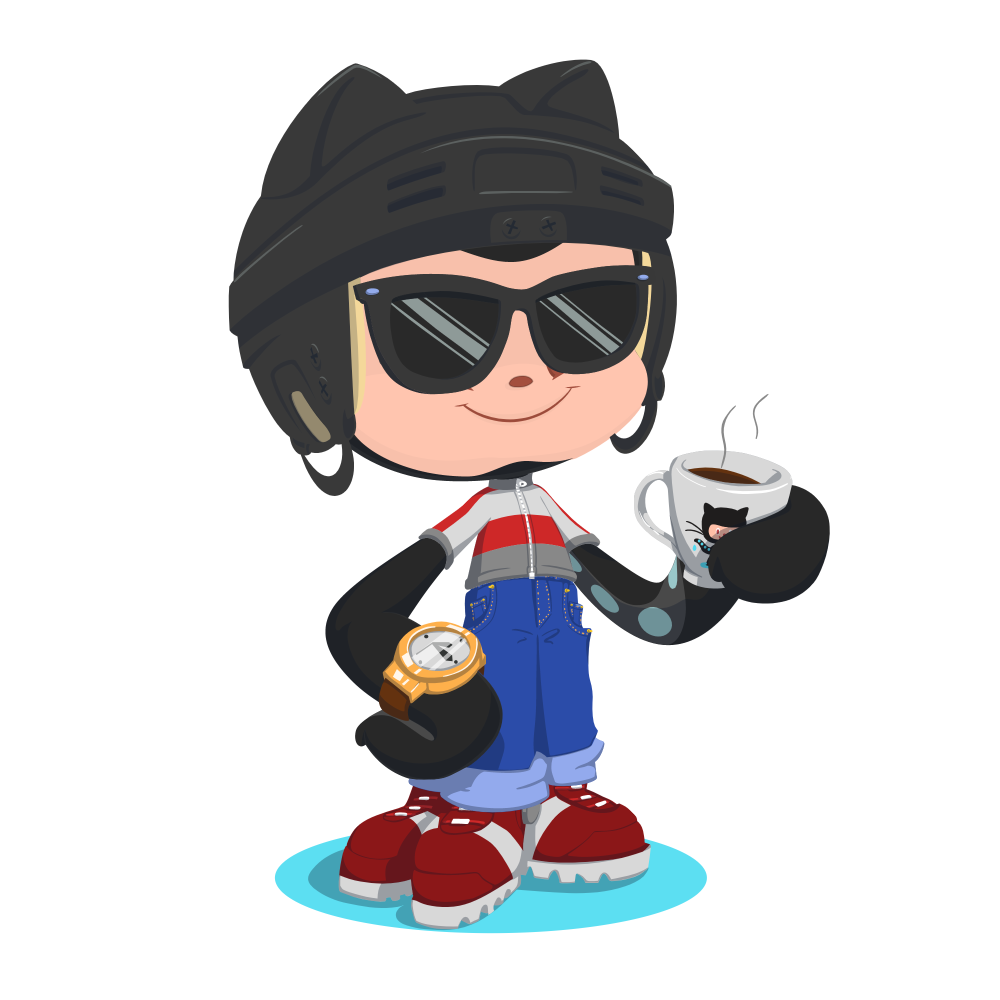

	

		
	

<h4 align="center">Finance nerd with a coding habit. I like building things, trading options, and drinking way too much coffee.</h4>
 

  

## 🔥 Streak Stats

## 🛠️ My Skills

### 👉 Programming Languages

  &emsp;
  
  &emsp;
  
  &emsp;
  
  &emsp;
  

### 👉 Databases & Cloud

  &emsp;
  
  &emsp;
  
  &emsp;
  
  &emsp;
  

### 👉 Software & Tools

  &emsp;
  
  &emsp;
  
  &emsp;
  
  &emsp;
  

 

## 📊 Github Stats
   

 

## 📬 Let's Connect

  
  
  
  
  

* Credit: [little-dao](https://github.com/little-dao)
* Last Edited on: 06/03/2026
